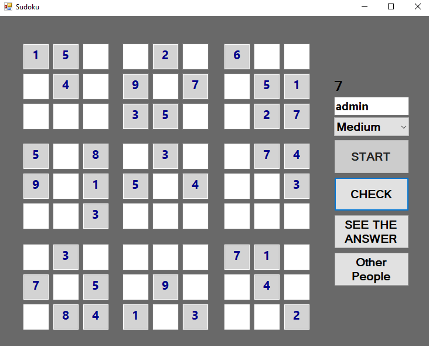
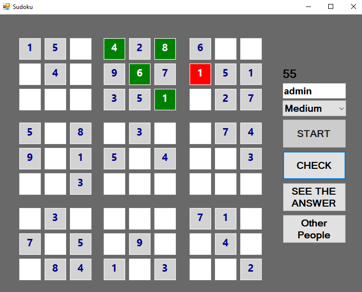
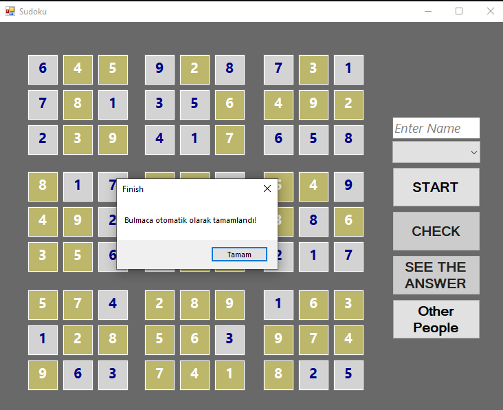
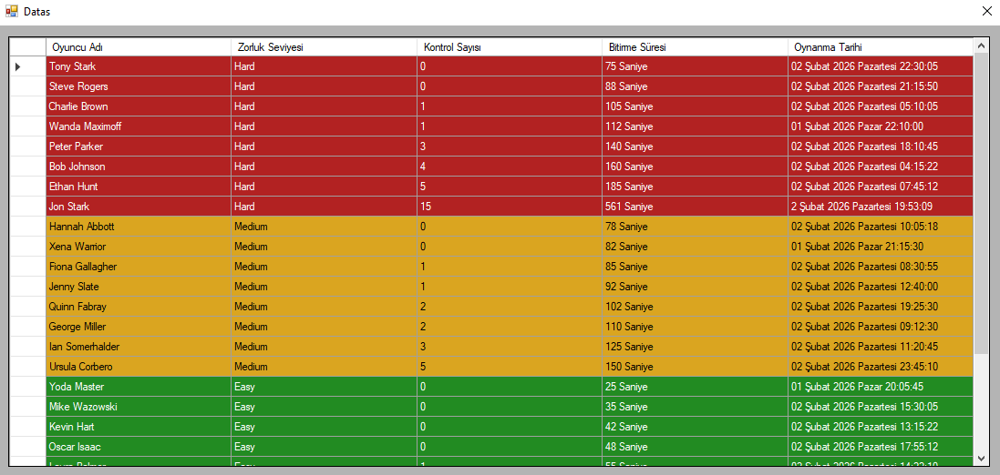

# 🧩 Sudoku Projesi

Sudoku Projesi, C# Windows Forms ve Microsoft SQL Server kullanılarak geliştirilmiş bir masaüstü Sudoku uygulamasıdır.

Proje; Sudoku oyun mantığını uygulamak, algoritma geliştirme pratiği yapmak, Windows Forms bileşenlerini kullanmak ve oyun sonuçlarını veritabanında saklamak amacıyla geliştirilmiştir.

## 🚀 Özellikler

- 9x9 Sudoku oyun tahtası
- Otomatik Sudoku oluşturma
- Backtracking algoritması ile Sudoku çözümü
- Easy, Medium ve Hard zorluk seviyeleri
- Oyuncu adı girişi
- Oyun süresi takibi
- Girilen sayıların kontrol edilmesi
- Doğru girişlerin yeşil renkle gösterilmesi
- Yanlış girişlerin kırmızı renkle gösterilmesi
- Çözümün otomatik gösterilmesi
- Oyun sonuçlarının SQL Server veritabanına kaydedilmesi
- Önceki oyuncuların sonuçlarının görüntülenmesi

## 🧠 Sudoku Algoritması

Sudoku oluşturma ve çözme işlemlerinde **Backtracking algoritması** kullanılmaktadır.

Algoritma, Sudoku tahtasındaki boş hücrelere uygun sayıları yerleştirerek ilerler. Bir sayı Sudoku kurallarını ihlal ettiğinde önceki adıma dönerek farklı bir sayı denenir.

Sayı yerleştirilirken:

- Aynı satırda aynı sayı bulunmaması
- Aynı sütunda aynı sayı bulunmaması
- Aynı 3x3 blok içerisinde aynı sayı bulunmaması

kontrol edilmektedir.

## 🎮 Zorluk Seviyeleri

Uygulamada üç farklı zorluk seviyesi bulunmaktadır:

- Easy
- Medium
- Hard

Seçilen zorluk seviyesine göre Sudoku tahtasından farklı sayıda hücre kaldırılarak oyun oluşturulmaktadır.

## ⏱️ Oyun ve Kontrol Sistemi

Oyuncu oyuna başladığında süre otomatik olarak takip edilmektedir.

**CHECK** butonu ile kullanıcının girdiği değerler kontrol edilir.

- Doğru değerler yeşil
- Yanlış değerler kırmızı

olarak gösterilir.

Oyuncu isterse **SEE THE ANSWER** seçeneği ile Sudoku'nun doğru çözümünü görüntüleyebilir.

## 🗄️ Veritabanı

Oyun tamamlandığında oyuncuya ait bilgiler Microsoft SQL Server veritabanına kaydedilmektedir.

Kaydedilen bilgiler:

- Oyuncu adı
- Zorluk seviyesi
- Kontrol sayısı
- Oyunu bitirme süresi
- Oynama tarihi

Bu kayıtlar uygulama içerisindeki diğer oyuncular ekranından görüntülenebilmektedir.

## 🛠️ Kullanılan Teknolojiler

- C#
- .NET Framework
- Windows Forms
- Microsoft SQL Server
- ADO.NET
- Visual Studio
- Git & GitHub

## 📸 Ekran Görüntüleri

### 🎮 Oyun Ekranı

Sudoku oyununun zorluk seviyesi seçilerek başlatıldığı ana oyun ekranı.

### ✅ Cevap Kontrolü

CHECK özelliği ile girilen değerler kontrol edilir. Doğru değerler yeşil, yanlış değerler kırmızı olarak gösterilir.

### 🧩 Otomatik Çözüm

SEE THE ANSWER özelliği ile Sudoku bulmacasının çözümü otomatik olarak tamamlanabilir.

### 📊 Oyuncu Sonuçları

Tamamlanan oyunlara ait oyuncu adı, zorluk seviyesi, kontrol sayısı, bitirme süresi ve oynanma tarihi SQL Server veritabanında saklanır ve uygulama üzerinden görüntülenebilir.

## 📚 Projede Öğrendiklerim

Bu proje ile birlikte;

- Windows Forms uygulama geliştirme
- Dinamik kontrol yönetimi
- Backtracking algoritması
- Recursive metot kullanımı
- Sudoku doğrulama algoritmaları
- Timer kullanımı
- SQL Server bağlantısı
- Veritabanına veri kaydetme ve listeleme
- Kullanıcı etkileşimlerinin yönetilmesi

konularında pratik yapma fırsatı buldum.
